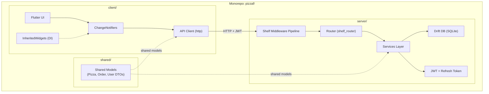

# 🍕 PizzaF — Full-Stack Pizza Ordering App

A beautiful pizza ordering app with half-and-half customization, built with **Flutter** (client) + **Dart shelf** (server) + **Drift** (SQLite) in a monorepo.

---

## User Review Required

> [!IMPORTANT]
> **Drift requires SQLite on the server.** You mentioned Drift — Drift on the server side works best with SQLite (lightweight, no external DB process). For a production deployment you'd want PostgreSQL via `drift_postgres`, but for this project I'll use **Drift + SQLite** on the server (file-based `pizza.db`). This keeps things simple and zero-config. Is this acceptable?

> [!IMPORTANT]
> **JWT lifetime = 1 hour** as you requested. Refresh tokens will live 14 days with rotation (each use issues a new refresh token and invalidates the old one).

> [!IMPORTANT]
> **"Pure Man's DI"** — I'll use manual constructor injection on the server and `InheritedWidget` + `ChangeNotifier` on the client. No `provider`, no `get_it`, no `injectable`. Just raw Dart.

---

## Open Questions

> [!NOTE]
> **Pizza menu data** — Should the pizza types be hardcoded in the app for now (pepperoni, margherita, BBQ chicken, etc.), or fetched from the server API? **Plan: fetch from server**, with seed data inserted on first run.

> [!NOTE]
> **Order tracking** — Should this be real-time via WebSockets, or polling-based? **Plan: polling** (every 10s) for simplicity, with the server exposing order status updates. We can upgrade to WebSockets later.

> [!NOTE]
> **Images** — I'll generate pizza artwork using the image generation tool to create beautiful, realistic pizza images for the menu. No placeholders.

---

## Proposed Architecture



---

## Proposed Changes

### Monorepo Structure

```
pizzaf/
├── client/                    # Flutter app
│   ├── lib/
│   │   ├── main.dart
│   │   ├── app.dart
│   │   ├── theme/
│   │   │   └── app_theme.dart
│   │   ├── core/
│   │   │   ├── di/
│   │   │   │   └── app_scope.dart          # InheritedWidget DI container
│   │   │   ├── api/
│   │   │   │   ├── api_client.dart         # HTTP client with JWT interceptor
│   │   │   │   └── token_storage.dart      # Secure token storage
│   │   │   └── widgets/
│   │   │       └── ... (shared widgets)
│   │   ├── features/
│   │   │   ├── auth/
│   │   │   │   ├── auth_notifier.dart
│   │   │   │   ├── login_screen.dart
│   │   │   │   └── register_screen.dart
│   │   │   ├── menu/
│   │   │   │   ├── menu_notifier.dart
│   │   │   │   ├── menu_screen.dart
│   │   │   │   └── widgets/
│   │   │   │       └── pizza_card.dart
│   │   │   ├── customizer/
│   │   │   │   ├── customizer_notifier.dart
│   │   │   │   ├── customizer_screen.dart
│   │   │   │   └── widgets/
│   │   │   │       ├── pizza_canvas.dart   # CustomPainter half-and-half
│   │   │   │       └── half_selector.dart
│   │   │   ├── cart/
│   │   │   │   ├── cart_notifier.dart
│   │   │   │   ├── cart_screen.dart
│   │   │   │   └── widgets/
│   │   │   │       └── cart_item_tile.dart
│   │   │   ├── orders/
│   │   │   │   ├── orders_notifier.dart
│   │   │   │   ├── order_history_screen.dart
│   │   │   │   └── order_tracking_screen.dart
│   │   │   └── splash/
│   │   │       └── splash_screen.dart
│   │   └── navigation/
│   │       └── app_router.dart
│   ├── assets/
│   │   └── images/                         # Generated pizza images
│   └── pubspec.yaml
├── server/                    # Dart backend
│   ├── bin/
│   │   └── server.dart                     # Entry point
│   ├── lib/
│   │   ├── src/
│   │   │   ├── middleware/
│   │   │   │   ├── auth_middleware.dart     # JWT verification
│   │   │   │   ├── cors_middleware.dart     # CORS headers
│   │   │   │   └── logging_middleware.dart  # Request logging
│   │   │   ├── routes/
│   │   │   │   ├── auth_routes.dart        # /auth/login, /auth/register, /auth/refresh
│   │   │   │   ├── pizza_routes.dart       # /pizzas (GET)
│   │   │   │   ├── order_routes.dart       # /orders CRUD
│   │   │   │   └── router.dart             # Main router assembly
│   │   │   ├── services/
│   │   │   │   ├── auth_service.dart       # Password hashing, JWT gen
│   │   │   │   ├── pizza_service.dart
│   │   │   │   └── order_service.dart
│   │   │   ├── db/
│   │   │   │   ├── database.dart           # Drift database class
│   │   │   │   ├── tables.dart             # Table definitions
│   │   │   │   └── seed.dart               # Seed data (pizza menu)
│   │   │   └── config/
│   │   │       └── env.dart                # JWT secret, port, etc.
│   │   └── server.dart                     # Library barrel
│   └── pubspec.yaml
└── shared/                    # Shared Dart models
    ├── lib/
    │   ├── shared.dart                     # Barrel export
    │   └── src/
    │       ├── models/
    │       │   ├── user.dart
    │       │   ├── pizza.dart              # PizzaType enum + PizzaHalf
    │       │   ├── cart_item.dart
    │       │   ├── order.dart
    │       │   └── auth_tokens.dart
    │       └── dtos/
    │           ├── login_request.dart
    │           ├── register_request.dart
    │           └── create_order_request.dart
    └── pubspec.yaml
```

---

### Shared Models (`shared/`)

#### [NEW] shared/lib/src/models/pizza.dart

Core pizza model with half-and-half support:

```dart
enum PizzaType {
  pepperoni, margherita, bbqChicken, hawaiian,
  fourCheese, veggie, meatLovers, buffalo;
}

class PizzaHalf {
  final PizzaType type;
  // which half: left or right
  final HalfSide side;
}

class CartPizza {
  final PizzaHalf leftHalf;
  final PizzaHalf rightHalf;
  final double price;  // sum of both halves
}
```

#### [NEW] shared/lib/src/models/order.dart

```dart
enum OrderStatus { placed, preparing, baking, ready, delivered }

class Order {
  final String id;
  final List<CartPizza> pizzas;
  final OrderStatus status;
  final DateTime createdAt;
  final double totalPrice;
}
```

---

### Server (`server/`)

#### [NEW] server/pubspec.yaml

Key dependencies:
```yaml
dependencies:
  shelf: ^1.4.0
  shelf_router: ^1.1.4
  dart_jsonwebtoken: ^3.4.1
  drift: ^2.0.0
  sqlite3_flutter_libs:  # NOT used — server uses native sqlite3
  sqlite3: any
  crypto: ^3.0.0         # For password hashing (SHA-256 + salt)
  uuid: ^4.0.0
  args: ^2.0.0
  shared:
    path: ../shared
```

---

#### [NEW] Middleware Pipeline

The shelf pipeline processes requests in this order:

```
Request → CORS → Logging → [Auth Guard] → Router → Response
```

1. **`cors_middleware.dart`** — Adds `Access-Control-Allow-*` headers, handles preflight `OPTIONS`.
2. **`logging_middleware.dart`** — Logs method, path, status code, and duration.
3. **`auth_middleware.dart`** — The core auth guard:
   - Checks `Authorization: Bearer <token>` header
   - Verifies JWT signature + expiration
   - If valid: attaches `userId` to request context (`request.change(context: {'userId': ...})`)
   - If invalid/expired: returns `401 Unauthorized`
   - **Skips** public routes: `/auth/login`, `/auth/register`, `/auth/refresh`

---

#### [NEW] Auth System Design

| Aspect | Detail |
|:---|:---|
| **Access Token** | JWT, HS256, expires in **1 hour** |
| **Refresh Token** | Opaque UUID, stored in DB, expires in **14 days** |
| **Refresh Rotation** | Each `/auth/refresh` call issues a new refresh token + invalidates old |
| **Password Storage** | SHA-256 hash with random salt |
| **Revocation** | Refresh tokens stored in `refresh_tokens` table, deleted on logout |

---

#### [NEW] API Endpoints

| Method | Path | Auth | Description |
|:---|:---|:---|:---|
| `POST` | `/auth/register` | ❌ | Create account (name, email, password) |
| `POST` | `/auth/login` | ❌ | Login → returns `{accessToken, refreshToken}` |
| `POST` | `/auth/refresh` | ❌ | Refresh → returns new token pair |
| `POST` | `/auth/logout` | ✅ | Invalidates refresh token |
| `GET` | `/pizzas` | ✅ | List all pizza types with prices |
| `POST` | `/orders` | ✅ | Place a new order |
| `GET` | `/orders` | ✅ | Get user's order history |
| `GET` | `/orders/<id>` | ✅ | Get order details + status |

---

#### [NEW] Database Tables (Drift)

```dart
// users table
class Users extends Table {
  TextColumn get id => text()();          // UUID
  TextColumn get name => text()();
  TextColumn get email => text().unique()();
  TextColumn get passwordHash => text()();
  TextColumn get salt => text()();
  DateTimeColumn get createdAt => dateTime().withDefault(currentDateAndTime)();
  @override Set<Column> get primaryKey => {id};
}

// refresh_tokens table
class RefreshTokens extends Table {
  TextColumn get token => text()();       // UUID
  TextColumn get userId => text().references(Users, #id)();
  DateTimeColumn get expiresAt => dateTime()();
  @override Set<Column> get primaryKey => {token};
}

// pizza_types table (seed data)
class PizzaTypes extends Table {
  TextColumn get id => text()();
  TextColumn get name => text()();
  TextColumn get description => text()();
  RealColumn get halfPrice => real()();   // Price for one half
  TextColumn get imageUrl => text()();
  @override Set<Column> get primaryKey => {id};
}

// orders table
class Orders extends Table {
  TextColumn get id => text()();
  TextColumn get userId => text().references(Users, #id)();
  TextColumn get status => text()();      // OrderStatus as string
  RealColumn get totalPrice => real()();
  DateTimeColumn get createdAt => dateTime().withDefault(currentDateAndTime)();
  @override Set<Column> get primaryKey => {id};
}

// order_items table (each half-and-half pizza in an order)
class OrderItems extends Table {
  IntColumn get id => integer().autoIncrement()();
  TextColumn get orderId => text().references(Orders, #id)();
  TextColumn get leftHalfType => text()();
  TextColumn get rightHalfType => text()();
  RealColumn get price => real()();
}
```

---

### Client (`client/`)

#### [NEW] client/pubspec.yaml

Key dependencies:
```yaml
dependencies:
  flutter:
    sdk: flutter
  http: ^1.0.0
  flutter_secure_storage: ^9.0.0
  google_fonts: ^6.0.0
  shared:
    path: ../shared
```

**No `provider`**, **no `get_it`** — pure `ChangeNotifier` + `InheritedWidget`.

---

#### [NEW] DI System — `AppScope` InheritedWidget

A single `InheritedWidget` at the top of the widget tree that holds all notifiers and services:

```dart
class AppScope extends InheritedWidget {
  final AuthNotifier authNotifier;
  final MenuNotifier menuNotifier;
  final CartNotifier cartNotifier;
  final OrdersNotifier ordersNotifier;
  final ApiClient apiClient;

  static AppScope of(BuildContext context) =>
    context.dependOnInheritedWidgetOfExactType<AppScope>()!;
  
  // ...
}
```

All notifiers are constructed in `main.dart` with their dependencies injected manually (constructor injection).

---

#### [NEW] Theme — Dark Glassmorphism

A premium dark theme with:
- **Background**: Deep dark gradient (`#0D0D1A` → `#1A1A2E`)
- **Accent**: Warm orange-amber (`#FF6B35` → `#F7931E`) for pizza vibes
- **Cards**: Glassmorphism with frosted blur, `0.08` white opacity, subtle border
- **Typography**: Google Fonts `Outfit` (headings) + `Inter` (body)
- **Micro-animations**: Hero transitions between screens, animated pizza builder, cart slide-up, shimmer loading

---

#### [NEW] Pizza Customizer — Half-and-Half Builder

The hero feature. A `CustomPainter` that renders:

```
┌─────────────────────────┐
│    🍕 Build Your Pizza   │
│                          │
│     ┌───────────┐        │
│     │ Left│Right │        │  ← Interactive pizza canvas
│     │ 🍕  │  🍕  │        │     Tap each half to select
│     │     │      │        │
│     └───────────┘        │
│                          │
│  [Pepperoni] [Margherita]│  ← Scrollable pizza type chips
│  [BBQ]  [Hawaiian] [...]  │
│                          │
│  Left: Pepperoni  $5.99  │  ← Selection summary
│  Right: Hawaiian  $5.99  │
│  ─────────────────────── │
│  Total: $11.98           │
│                          │
│  [🛒 Add to Cart]        │
└─────────────────────────┘
```

- Tap left/right half of the pizza to select which side you're customizing
- The selected half glows with the accent color
- Smooth animation when a pizza type is applied to a half
- The pizza canvas uses `CustomPainter` with `ClipPath` semicircles

---

#### [NEW] Screens Overview

| Screen | Description |
|:---|:---|
| **Splash** | App logo with fade-in animation, checks token validity |
| **Login / Register** | Glassmorphic card forms, smooth transitions between login↔register |
| **Menu** | Grid of pizza cards with images, prices, "Customize" button |
| **Customizer** | Half-and-half pizza builder (see above) |
| **Cart** | List of configured pizzas, swipe-to-delete, total, "Place Order" |
| **Order History** | List of past orders with status badges |
| **Order Tracking** | Live status stepper (placed → preparing → baking → ready → delivered) |

---

#### [NEW] API Client with Auto-Refresh

The `ApiClient` class wraps `http.Client` and automatically:
1. Attaches `Authorization: Bearer <accessToken>` to all requests
2. On `401` response → calls `/auth/refresh` with the stored refresh token
3. Retries the original request with the new access token
4. If refresh fails → redirects to login screen

---

## Implementation Order

1. **`shared/`** — Models + DTOs (no dependencies)
2. **`server/`** — Database → Services → Routes → Middleware → Entry point
3. **`client/`** — Theme → API client → DI → Auth screens → Menu → Customizer → Cart → Orders
4. **Assets** — Generate pizza images
5. **Integration testing** — End-to-end flow

---

## Verification Plan

### Automated Tests
1. **Server**: Run `dart run bin/server.dart` and test endpoints with `curl`:
   - Register → Login → Get pizzas → Place order → Check order status
   - Verify 401 on expired tokens
   - Verify refresh token rotation
2. **Client**: Run `flutter run` on simulator/device
3. **Drift DB**: Verify migrations with `dart test` on server

### Manual Verification
- Visual inspection of all UI screens
- Test the half-and-half pizza customizer interaction
- Verify smooth animations and glassmorphism effects
- Test the full auth flow: register → login → token expiry → auto-refresh → logout
